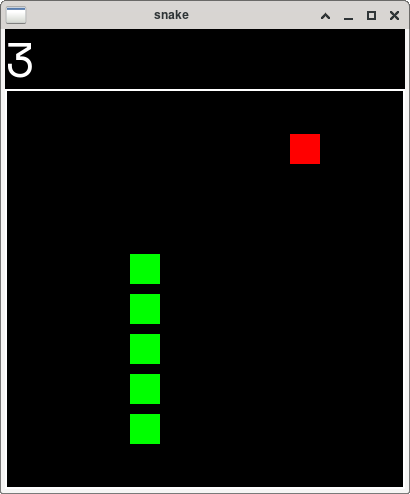

# C++ Snake

A snake game writting in C++23 using SFML 3.0.



## Build Prerequisites

- GCC 14 or later.
- CMake 3.22 or later.
- SMFL 3.0 installed and findable by CMake.

## How to Build

```sh
git clone https://github.com/jochemarends/cpp-snake.git
cd cpp-snake
mkdir build && cd build
cmake ..
cmake --build .
```

# Controls

The controls are inspired by Vi motions.

- `K` = Up
- `J` = Down
- `H` = Left
- `L` = Right

